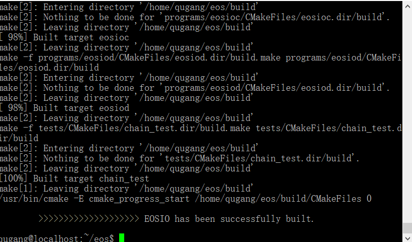

# 搭建EOS本地网络 ubuntu 环境

## 编译源码

> 安装ubuntu 可以使用虚拟机 必须8G内存40G硬盘以上，推荐使用16.04
>
> 安装完成后执行命令:

```
git clone https://github.com/eosio/eos --recursive

cd eos
./eosio_build.sh
```

> eosio_build.sh 脚本会自动检查与更新使用到C++库，请确保 ubuntu 的更新源可用的
>
> 看到下面截图说明build成功
>
>
>
> 然后执行 sudo make install

## 启动节点

>cd ~/eos/build/programs/eosiod/
>
>执行 eosiod